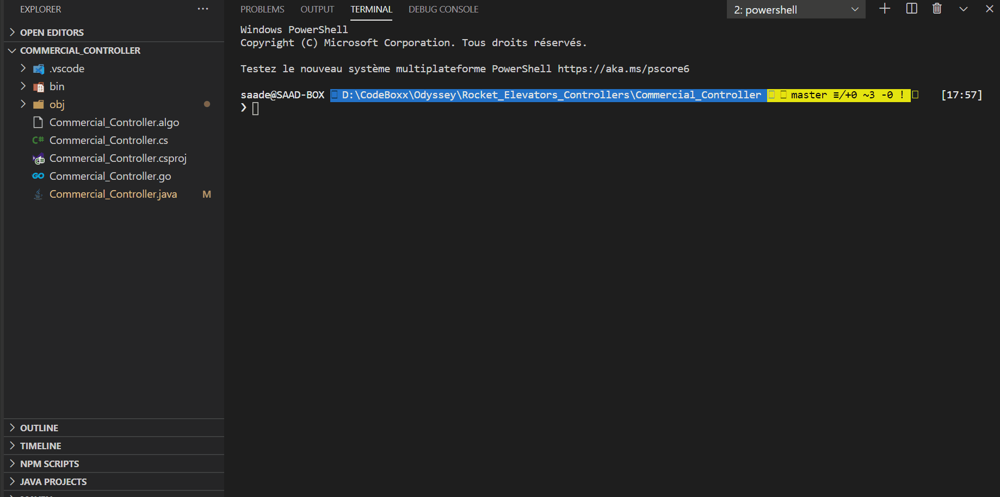

&#xa0;

  <!-- Saad Eddine FEKI -->
</div>

<h1 align="center"> 🚀 Rocket Elevators</h1>

<!-- Status -->

<h4 align="center">
  CodeBoxx
</h4>

<hr>
<br>

## :dart: About:

<h4>🔥 This repository contains the algorithm files for the elevator controllers for the New Rocket Elevator Solutions for both Residential and Commercial Offers.</h4>
repository structure
<ul>
<li>📂 Residential Controller</li>
  <ol>
  <li>📝Residential Controller: Algorithm </li>
  <li>📝 Javascript</li>
  <li>📝 Python</li>
  <li>📝 Ruby</li>
  </ol>
<li>📂Commercial Controller</li>
  <ol>
  <li>📝Commercial Controller: Algorithm</li>
  <li>📝 C# (en .NET Core)</li>
  <li>📝 GO Lang</li>
  <li>📝 Java</li>
  </ol>
</ul>
<h1>1. Residential Controller</h1>
🔥 Rocket_Elevators_Controllers.js : implementation of the algorithm in javascript:
<p>
- Testing section : you can use Node js or the html interface to run the script
```sh
node Residential_Controller.js
```
- Testing interface: index.html and console (html+ Bootstrap)

🔥 Rocket_Elevators_Controllers.py: implementation of the algorithm in Python:

- Testing section with all the scenario: i used a class bcolors to make the testing experience in the console much better with some color
- you can use the command:

```sh
python Rocket_Elevators_Controllers.py
```

🔥 Rocket_Elevators_Controllers.rb: implementation of the algorithm in Ruby:

- Testing section with all the scenario provided
- you can use the comand: ruby .\Residential_Controller.rb to run the script

```sh
ruby .\Residential_Controller.rb
```

</p>

## 📽️ Video demo:

<a href="https://vimeo.com/464412061" target="_blank"> Link to video demo (Vimeo): Js, Python and Ruby implementation</a></br>
<a href="https://youtu.be/OQV_e5cA7wc" target="_blank"> Link to video demo: Algorithms</a>

<h1>2. Commercial Controller</h1>

<h2> C# (en .NET Core): Commercial_Controller.cs</h2>

```sh
dotnet run
```

## 📽️ Video demo:

<a href="https://youtu.be/LkEXhnPJzA0" target="_blank"> Link to video demo (Youtube): Implementation in C#, GO Lang and Java of the commercial controller algorithm</a>

<h2>Illustration:</h2>



<hr>
<h2>GO Lang: Commercial_Controller.go</h2>
II. GO Lang: Commercial_Controller.go

```sh
go run .\Commercial_Controller.go
```

<h2>Illustration:</h2>


<hr>
<h2>JAVA: Commercial_Controller.java</h2>

```sh
Right click on the Commercial_Controller.java And run
```

<h2>Illustration:</h2>


<h1>Requirements</h1>

<a href="https://marketplace.visualstudio.com/items?itemName=CodeBoxx.pseudo-algo" target="_blank">CodeBoxx Pseudocode Syntax</a>

<ul>
<li>Python</li>
<li>Ruby</li>
<li>Go Lang extensions</li>
<li>.NET Core</li>
<li>Java SE Development Kit (JDK )</li>
</ul>

 <h4 align="center">
 Made with ❤️ in Quebec by Saad
</h4>
<a href="#top">Back to top</a>
